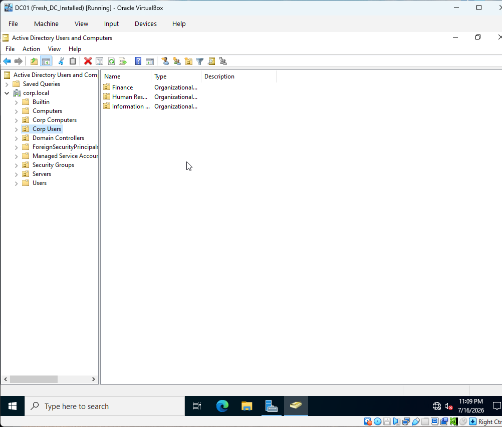
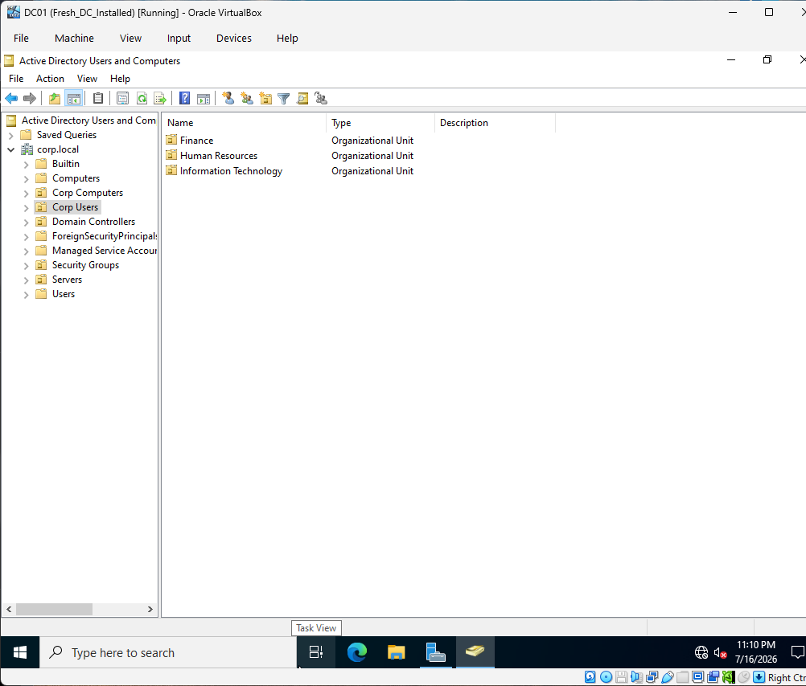
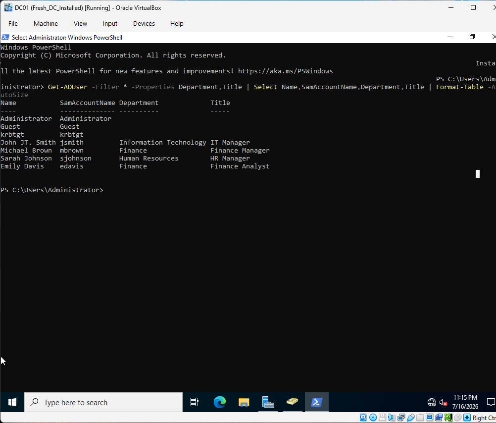
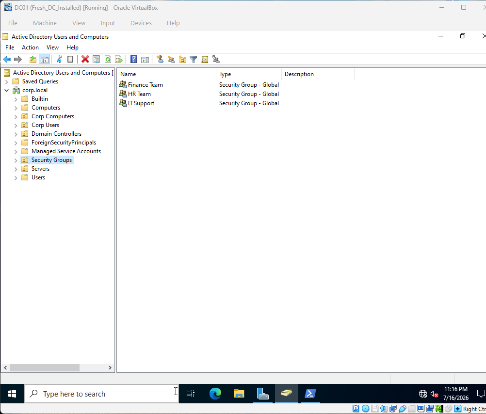
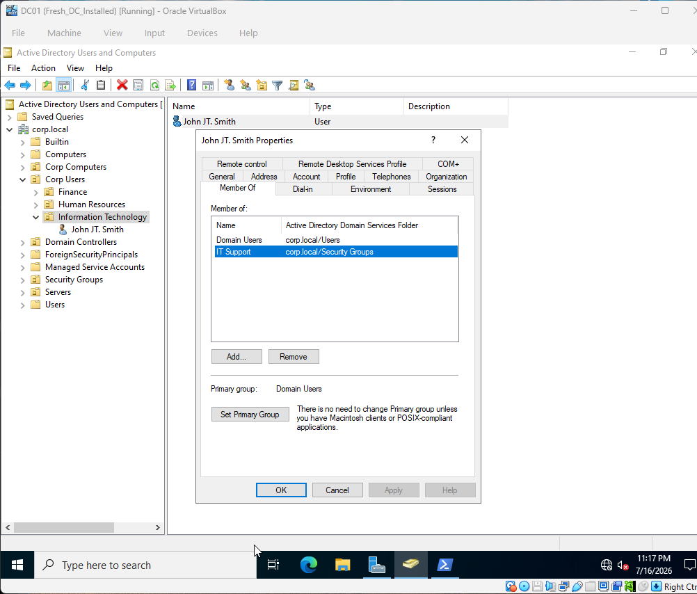
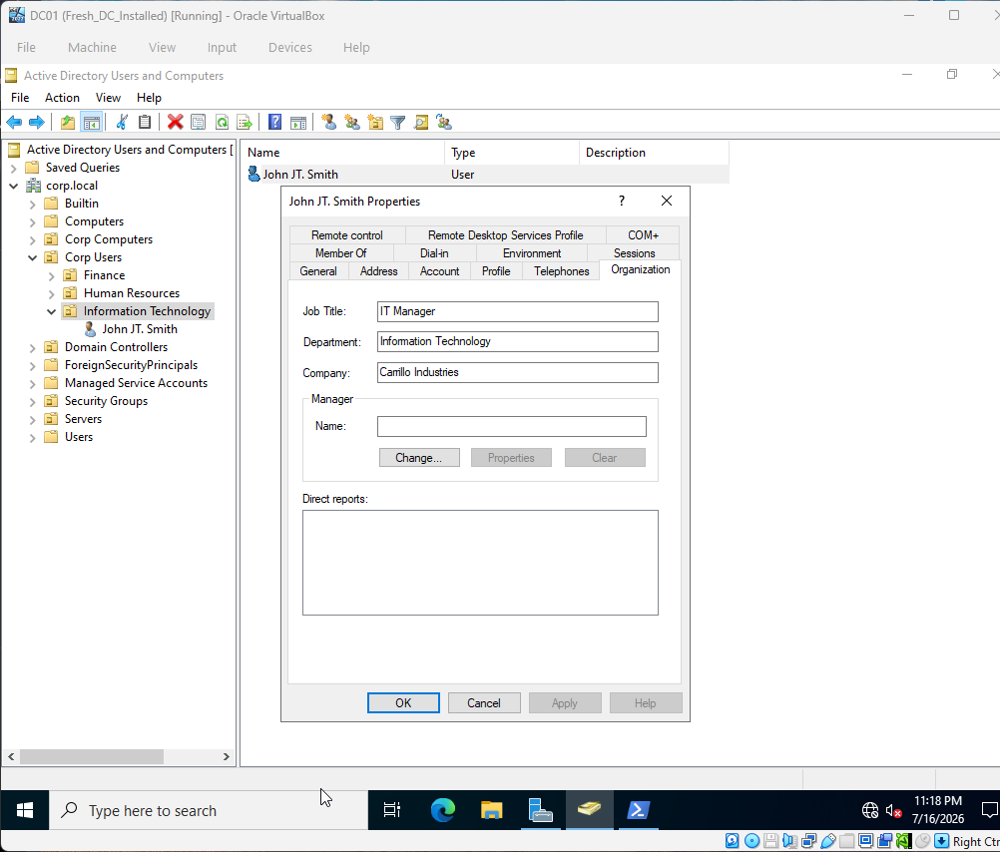
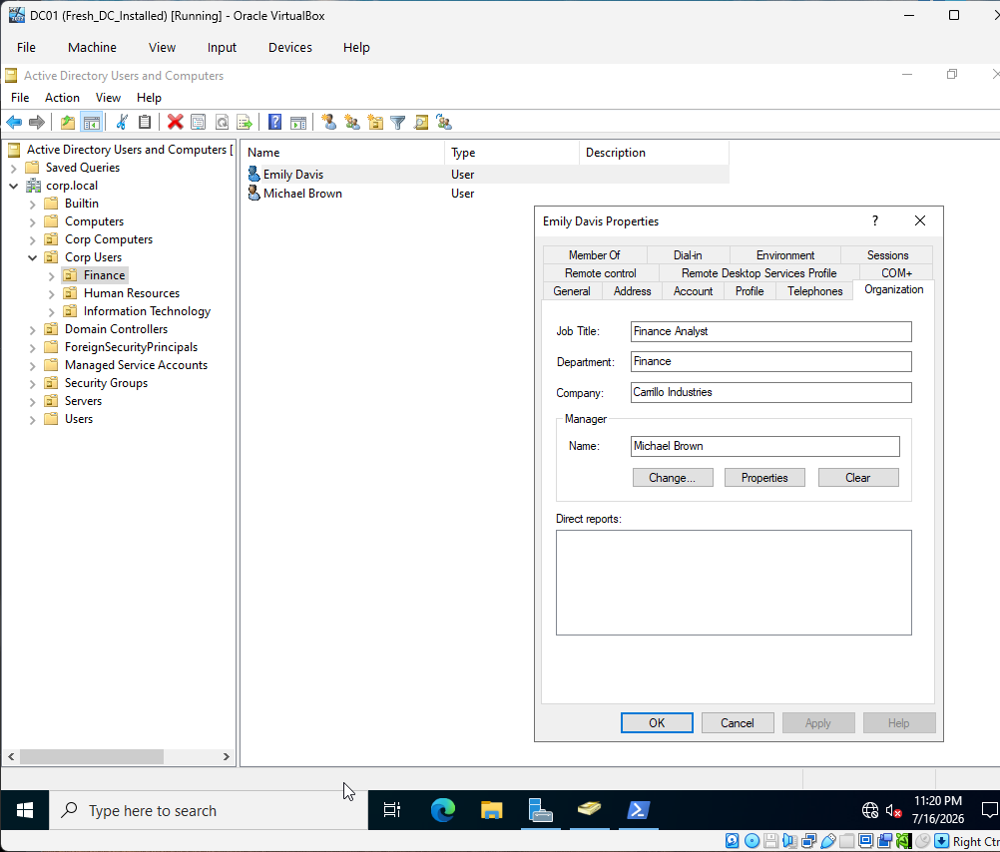
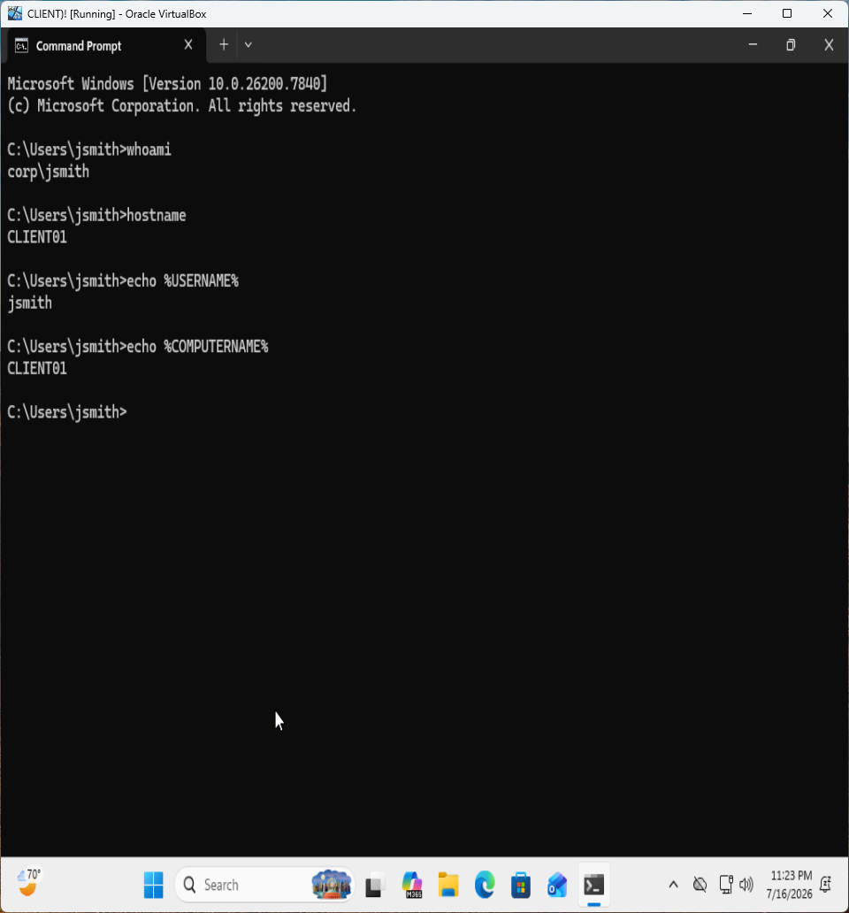

# Active Directory Enterprise Identity & Access Management Lab

## Overview

This lab builds upon an existing Windows Server 2022 Active Directory environment by implementing core Identity & Access Management (IAM) concepts within an enterprise domain.

The project focuses on designing a scalable Active Directory structure, creating and managing user identities, implementing Role-Based Access Control (RBAC) through Global Security Groups, organizing resources using Organizational Units (OUs), and validating domain authentication from a Windows client.

These tasks simulate foundational Identity & Access Management responsibilities commonly performed by Help Desk Technicians, Systems Administrators, and Identity & Access Management (IAM) administrators in enterprise environments.

---

## Project Resources

- 📄 **GitHub Repository:** *(current repository)*
- 🎥 **Video Walkthrough:** https://youtu.be/ta4YGWM2m0s

---

## Objectives

- Design a scalable Organizational Unit (OU) structure
- Create and manage enterprise user identities
- Implement Global Security Groups
- Apply Role-Based Access Control (RBAC)
- Populate enterprise identity attributes
- Configure manager relationships
- Validate Active Directory authentication
- Reinforce Identity & Access Management best practices

---

## Technologies Used

- Windows Server 2022
- Active Directory Domain Services (AD DS)
- Active Directory Users and Computers (ADUC)
- Windows 11 Enterprise
- PowerShell
- NTFS Permissions
- Role-Based Access Control (RBAC)

---

## Lab Environment

| Component | Technology |
|-----------|------------|
| Domain Controller | Windows Server 2022 |
| Client Machine | Windows 11 |
| Directory Service | Active Directory Domain Services |
| Domain | corp.local |

---

## Organizational Unit Structure

```
corp.local
│
├── Corp Users
│   ├── IT
│   ├── HR
│   └── Finance
│
├── Corp Computers
│   ├── IT
│   ├── HR
│   └── Finance
│
├── Security Groups
│
└── Servers
```

---

## Enterprise Identities Created

| Name | Username | Department | Job Title |
|------|----------|------------|-----------|
| John Smith | jsmith | IT | IT Manager |
| Sarah Johnson | sjohnson | HR | HR Manager |
| Michael Brown | mbrown | Finance | Finance Manager |
| Emily Davis | edavis | Finance | Finance Analyst |

---

## Access Control

Global Security Groups were created to implement Role-Based Access Control (RBAC):

- IT Support
- HR Team
- Finance Team

Users were assigned to the appropriate Security Groups rather than assigning permissions directly to individual accounts.

---

## Identity Validation

Domain authentication was validated by logging into the Windows 11 client using a domain account.

Verification commands:

```cmd
whoami
hostname
echo %USERNAME%
echo %COMPUTERNAME%
```

Example output:

```text
CORP\jsmith
CLIENT01
jsmith
CLIENT01
```

---

## Skills Demonstrated

- Active Directory Administration
- Identity & Access Management (IAM)
- Organizational Unit (OU) Design
- Enterprise Identity Administration
- User Lifecycle Management
- Global Security Group Administration
- Role-Based Access Control (RBAC)
- Authentication & Authorization
- Windows Domain Administration
- Active Directory User Attribute Management
- Basic Active Directory Troubleshooting

---

## Key Concepts Learned

- Organizational Units organize enterprise resources and enable Group Policy targeting.
- Identity management begins with properly designed user accounts and directory structures.
- Authentication verifies identity while authorization determines resource access.
- Security Groups simplify permission management and support Role-Based Access Control.
- Enterprise user attributes improve organizational management and directory services.
- Manager relationships establish reporting structures throughout the directory.

---

## Future Improvements

Planned enhancements include:

- Group Policy Administration
- NTFS & Shared Folder Permissions
- Microsoft 365 Administration
- Microsoft Entra ID Integration
- Hybrid Identity
- Multi-Factor Authentication (MFA)
- Conditional Access
- Single Sign-On (SSO)

---

# Screenshots

## Active Directory Domain Structure

The domain preserves the default Active Directory containers while introducing custom Organizational Units to organize enterprise resources and support scalable administration.



---

## Department Organizational Units

Department-based Organizational Units separate IT, Human Resources, and Finance users, providing the foundation for delegated administration and future Group Policy deployment.



---

## Enterprise User Identities

Enterprise user accounts were created with standardized naming conventions and business attributes to simulate a production Active Directory environment.



---

## Global Security Groups

Role-Based Access Control (RBAC) was implemented through Global Security Groups representing each department.



---

## RBAC Group Membership

Users were assigned to department-specific security groups to simplify permission management and demonstrate least-privilege administration.



---

## Enterprise User Properties

Business attributes—including job title, department, company, office location, and organizational information—were populated to simulate a realistic enterprise identity directory.



---

## Manager Relationships

Manager assignments establish organizational hierarchy within Active Directory and support enterprise features such as address books, workflows, and reporting structures.



---

## Domain Authentication Validation

A successful domain logon was verified from a domain-joined workstation using standard Windows commands to confirm Active Directory authentication.


