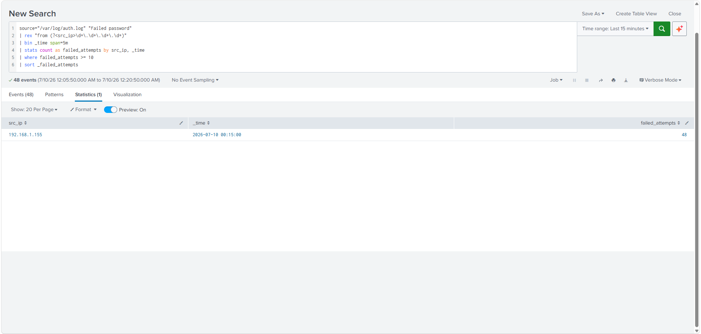
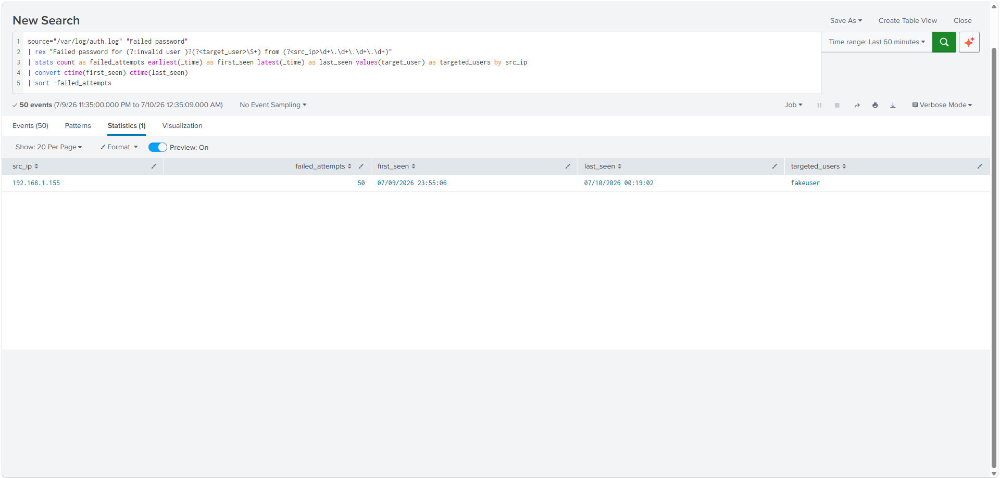
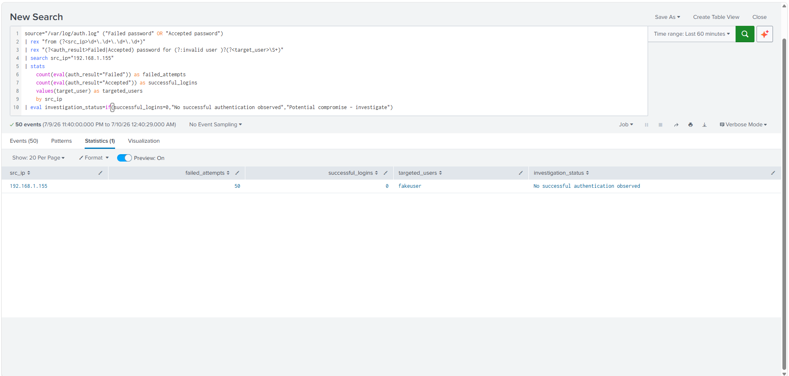
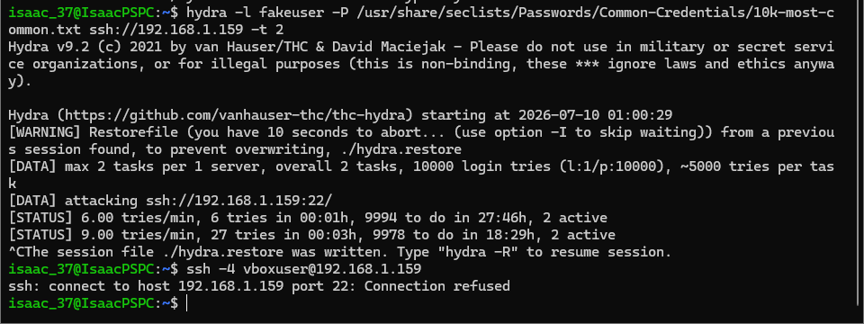

# Splunk SIEM – SSH Brute Force Detection, Investigation & Automated Containment

> **Project Type:** Detection Engineering • Incident Response • SIEM • Linux Security

This project demonstrates the end-to-end detection and investigation of a simulated SSH brute-force attack against an Ubuntu Server. Linux authentication logs were centralized in Splunk using the Splunk Universal Forwarder, custom SPL detections were developed, the attack was investigated through a SOC-style workflow, and automated containment was verified using Fail2Ban and nftables.

---

# Project Information

| Item | Value |
|------|-------|
| Difficulty | Intermediate |
| Environment | Home Lab |
| SIEM | Splunk Enterprise Free |
| Target Host | Ubuntu Server (BMAX B1 Pro) |
| Analyst Workstation | PowerSpec Windows 11 |
| Attack Host | Ubuntu WSL |
| Attack Tool | Hydra |
| Defense | Fail2Ban + nftables |

# Skills Demonstrated

| Category | Technologies |
|----------|--------------|
| SIEM | Splunk Enterprise |
| Detection Engineering | SPL, Regex (`rex`) |
| Linux | Ubuntu Server, auth.log |
| Log Collection | Splunk Universal Forwarder |
| Security | Fail2Ban, nftables |
| Attack Simulation | Hydra |
| Investigation | Incident Triage & Scoping |
| Networking | SSH, TCP/9997 |

# Architecture

```text
PowerSpec Workstation
├── Windows 11
├── Splunk Enterprise
└── Ubuntu WSL (Hydra)
            │
            │ SSH Brute Force
            ▼
BMAX B1 Pro
└── Ubuntu Server
    ├── OpenSSH
    ├── /var/log/auth.log
    ├── Splunk Universal Forwarder
    ├── Fail2Ban
    └── nftables
            │
            │ TCP 9997
            ▼
Splunk Enterprise
```

# Objectives

- Centralize Linux authentication logs
- Detect SSH brute-force activity
- Extract attacker IP from raw logs
- Investigate attack scope
- Determine whether compromise occurred
- Visualize activity in Splunk
- Validate automated containment

# Screenshots

## Detection Triggered

Threshold-based SPL detected more than 10 failed SSH attempts within five minutes.



## Incident Investigation

Identified attacking IP, targeted account, and attack timeframe.



## Compromise Assessment

Confirmed 50 failed logins and **0 successful logins**.



## SOC Dashboard

Custom dashboard built for investigation.


## Response & Containment

Fail2Ban banned the attacking IP and SSH access was denied.

(Linux Lab 3 Screenshot #6.2.png)

# Detection Logic

```spl
source="/var/log/auth.log" "Failed password"
| rex "from (?<src_ip>\d+\.\d+\.\d+\.\d+)"
| bin _time span=5m
| stats count as failed_attempts by src_ip,_time
| where failed_attempts>=10
| sort -failed_attempts
```

# Investigation Findings

- Attacker IP: **192.168.1.155**
- Targeted account: **fakeuser**
- Detection threshold reached: **48 failed attempts**
- Total scoped failures: **50**
- Successful logins: **0**
- Outcome: **No successful authentication observed**

# Troubleshooting

## Universal Forwarder Inactive

**Issue**

Forwarder appeared as *Configured but inactive*.

**Root Cause**

Windows Defender Firewall blocked inbound TCP/9997.

**Resolution**

- Enabled receiving on TCP/9997
- Created inbound firewall rule
- Verified Active Forwards

## Missing src_ip Field

Used `rex` to extract the source IP from raw Linux authentication logs.

## Fail2Ban During Testing

Fail2Ban blocked the attacker before enough telemetry was generated.

Resolution:

- Unbanned attacker
- Temporarily stopped Fail2Ban
- Generated telemetry
- Re-enabled Fail2Ban
- Verified automated containment

## Splunk Licensing

Enterprise trial expired during the project.

Migrated to **Splunk Free** and continued using reports and dashboards.

# Lessons Learned

- Detection quality depends on reliable log ingestion.
- Raw logs often require custom field extraction.
- Troubleshooting infrastructure is part of security engineering.
- Security controls can affect telemetry generation during testing.
- Investigation should answer both **what happened** and **whether compromise occurred**.

# Project Outcomes

- ✅ Centralized Linux authentication logs
- ✅ Built SPL detections
- ✅ Investigated attack source
- ✅ Verified no successful compromise
- ✅ Built reusable SOC dashboard
- ✅ Validated Fail2Ban containment

# MITRE ATT&CK

| Technique | Description |
|-----------|-------------|
| T1110 | Brute Force |
| T1110.001 | Password Guessing |
| T1078 | Valid Accounts Assessment |

# Resume Bullet

> Built a Splunk SIEM environment that ingested Ubuntu authentication logs via the Splunk Universal Forwarder, developed SPL detections for SSH brute-force activity, investigated attacker behavior through custom searches and dashboards, and validated automated containment using Fail2Ban and nftables.

# Roadmap

- Windows Event Logs
- Sysmon integration
- Active Directory authentication monitoring
- Sigma rule development
- Additional MITRE ATT&CK detections
- Email/webhook alerting
